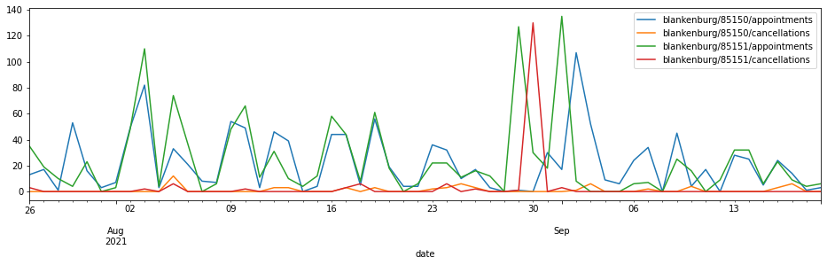

```python
import sys
sys.path.insert(0, "..")
```

# Data access

All data is presented as CSV files, most of it compressed into `tar.gz` files. For convenient access in Python you can use: 


```python
from src.data import Data, Metrics
```

## Direct table access

Each source (identified by `source_id`) is published as a single CSV file for each week. The CSVs contain the **free dates** that have been reported by the website **at each snapshot time** (typically every 15 minutes) for **each sub-location** ((identified by `location_id`) of the source. Those sub-locations typically are separate offices but can also represent the same office through different schedules or locations in different cities.

`source_id` and `location_id` together form the unique ID of one calendar, sampled at the snapshot `date`. 

Individual tables can be accessed with the `Data.get_table` class method:


```python
# get table for specific calendar week and source_id
columns, rows = Data.get_table((2021, 30), "leipzig")
print(columns[:5])
print(rows[0][:5])
```

    ['date', 'source_id', 'location_id', '2021-07-26 07:30:00', '2021-07-26 08:00:00']
    ['2021-07-26 00:03:13', 'leipzig', '1222936509', '', '']


Or with the `Data.get_dataframe` class method which returns a [pandas.DataFrame](https://pandas.pydata.org/pandas-docs/stable/reference/api/pandas.DataFrame.html):


```python
Data.get_dataframe((2021, 30), "leipzig")
```


<div>
<style>
    .dataframe tbody tr th:only-of-type {
        vertical-align: middle;
    }
    .dataframe tbody tr th {
        vertical-align: top;
    }
    .dataframe thead th {
        text-align: right;
    }
</style>
<table border="1" class="dataframe">
  <thead>
    <tr style="text-align: right;">
      <th></th>
      <th></th>
      <th></th>
      <th>2021-07-26 07:30:00</th>
      <th>2021-07-26 08:00:00</th>
      <th>2021-07-26 08:05:00</th>
      <th>2021-07-26 08:10:00</th>
      <th>2021-07-26 08:15:00</th>
      <th>2021-07-26 08:20:00</th>
      <th>2021-07-26 08:25:00</th>
      <th>2021-07-26 08:30:00</th>
      <th>2021-07-26 08:35:00</th>
      <th>2021-07-26 08:40:00</th>
      <th>...</th>
      <th>2021-08-28 11:55:00</th>
      <th>2021-08-28 12:00:00</th>
      <th>2021-08-28 12:05:00</th>
      <th>2021-08-28 12:10:00</th>
      <th>2021-08-28 12:15:00</th>
      <th>2021-08-28 12:20:00</th>
      <th>2021-08-28 12:25:00</th>
      <th>2021-08-28 12:30:00</th>
      <th>2021-08-28 12:35:00</th>
      <th>2021-08-28 12:40:00</th>
    </tr>
    <tr>
      <th>date</th>
      <th>source_id</th>
      <th>location_id</th>
      <th></th>
      <th></th>
      <th></th>
      <th></th>
      <th></th>
      <th></th>
      <th></th>
      <th></th>
      <th></th>
      <th></th>
      <th></th>
      <th></th>
      <th></th>
      <th></th>
      <th></th>
      <th></th>
      <th></th>
      <th></th>
      <th></th>
      <th></th>
      <th></th>
    </tr>
  </thead>
  <tbody>
    <tr>
      <th rowspan="5" valign="top">2021-07-26 00:03:13</th>
      <th rowspan="5" valign="top">leipzig</th>
      <th>1222936509</th>
      <td>0</td>
      <td>0</td>
      <td>0</td>
      <td>0</td>
      <td>0</td>
      <td>0</td>
      <td>0</td>
      <td>0</td>
      <td>0</td>
      <td>0</td>
      <td>...</td>
      <td>0</td>
      <td>0</td>
      <td>0</td>
      <td>0</td>
      <td>0</td>
      <td>0</td>
      <td>0</td>
      <td>0</td>
      <td>0</td>
      <td>0</td>
    </tr>
    <tr>
      <th>1229610602</th>
      <td>0</td>
      <td>0</td>
      <td>0</td>
      <td>0</td>
      <td>0</td>
      <td>0</td>
      <td>0</td>
      <td>0</td>
      <td>0</td>
      <td>0</td>
      <td>...</td>
      <td>0</td>
      <td>0</td>
      <td>0</td>
      <td>0</td>
      <td>0</td>
      <td>0</td>
      <td>0</td>
      <td>0</td>
      <td>0</td>
      <td>0</td>
    </tr>
    <tr>
      <th>1279700237</th>
      <td>0</td>
      <td>0</td>
      <td>0</td>
      <td>0</td>
      <td>0</td>
      <td>0</td>
      <td>0</td>
      <td>0</td>
      <td>0</td>
      <td>0</td>
      <td>...</td>
      <td>0</td>
      <td>0</td>
      <td>0</td>
      <td>0</td>
      <td>0</td>
      <td>0</td>
      <td>0</td>
      <td>0</td>
      <td>0</td>
      <td>0</td>
    </tr>
    <tr>
      <th>1286254497</th>
      <td>0</td>
      <td>0</td>
      <td>0</td>
      <td>0</td>
      <td>0</td>
      <td>0</td>
      <td>0</td>
      <td>0</td>
      <td>0</td>
      <td>0</td>
      <td>...</td>
      <td>0</td>
      <td>0</td>
      <td>0</td>
      <td>0</td>
      <td>0</td>
      <td>0</td>
      <td>0</td>
      <td>0</td>
      <td>0</td>
      <td>0</td>
    </tr>
    <tr>
      <th>1317803115</th>
      <td>0</td>
      <td>0</td>
      <td>0</td>
      <td>0</td>
      <td>0</td>
      <td>0</td>
      <td>0</td>
      <td>0</td>
      <td>0</td>
      <td>0</td>
      <td>...</td>
      <td>0</td>
      <td>0</td>
      <td>0</td>
      <td>0</td>
      <td>0</td>
      <td>0</td>
      <td>0</td>
      <td>0</td>
      <td>0</td>
      <td>0</td>
    </tr>
    <tr>
      <th>...</th>
      <th>...</th>
      <th>...</th>
      <td>...</td>
      <td>...</td>
      <td>...</td>
      <td>...</td>
      <td>...</td>
      <td>...</td>
      <td>...</td>
      <td>...</td>
      <td>...</td>
      <td>...</td>
      <td>...</td>
      <td>...</td>
      <td>...</td>
      <td>...</td>
      <td>...</td>
      <td>...</td>
      <td>...</td>
      <td>...</td>
      <td>...</td>
      <td>...</td>
      <td>...</td>
    </tr>
    <tr>
      <th rowspan="5" valign="top">2021-08-01 23:48:15</th>
      <th rowspan="5" valign="top">leipzig</th>
      <th>1586953390193</th>
      <td>0</td>
      <td>0</td>
      <td>0</td>
      <td>0</td>
      <td>0</td>
      <td>0</td>
      <td>0</td>
      <td>0</td>
      <td>0</td>
      <td>0</td>
      <td>...</td>
      <td>0</td>
      <td>0</td>
      <td>0</td>
      <td>0</td>
      <td>0</td>
      <td>0</td>
      <td>0</td>
      <td>0</td>
      <td>0</td>
      <td>0</td>
    </tr>
    <tr>
      <th>1590558418052</th>
      <td>0</td>
      <td>0</td>
      <td>0</td>
      <td>0</td>
      <td>0</td>
      <td>0</td>
      <td>0</td>
      <td>0</td>
      <td>0</td>
      <td>0</td>
      <td>...</td>
      <td>0</td>
      <td>0</td>
      <td>0</td>
      <td>0</td>
      <td>0</td>
      <td>0</td>
      <td>0</td>
      <td>0</td>
      <td>0</td>
      <td>0</td>
    </tr>
    <tr>
      <th>1590558471805</th>
      <td>0</td>
      <td>0</td>
      <td>0</td>
      <td>0</td>
      <td>0</td>
      <td>0</td>
      <td>0</td>
      <td>0</td>
      <td>0</td>
      <td>0</td>
      <td>...</td>
      <td>0</td>
      <td>0</td>
      <td>0</td>
      <td>0</td>
      <td>0</td>
      <td>0</td>
      <td>0</td>
      <td>0</td>
      <td>0</td>
      <td>0</td>
    </tr>
    <tr>
      <th>1595996515007</th>
      <td>0</td>
      <td>0</td>
      <td>0</td>
      <td>0</td>
      <td>0</td>
      <td>0</td>
      <td>0</td>
      <td>0</td>
      <td>0</td>
      <td>0</td>
      <td>...</td>
      <td>0</td>
      <td>0</td>
      <td>0</td>
      <td>0</td>
      <td>0</td>
      <td>0</td>
      <td>0</td>
      <td>0</td>
      <td>0</td>
      <td>0</td>
    </tr>
    <tr>
      <th>1595996623129</th>
      <td>0</td>
      <td>0</td>
      <td>0</td>
      <td>0</td>
      <td>0</td>
      <td>0</td>
      <td>0</td>
      <td>0</td>
      <td>0</td>
      <td>0</td>
      <td>...</td>
      <td>0</td>
      <td>0</td>
      <td>0</td>
      <td>0</td>
      <td>0</td>
      <td>0</td>
      <td>0</td>
      <td>0</td>
      <td>0</td>
      <td>0</td>
    </tr>
  </tbody>
</table>
<p>14784 rows × 2035 columns</p>
</div>


For convenience, both methods support adding the names from the [metadata.json](compressed/metadata.json) file:


```python
Data.get_dataframe((2021, 30), "leipzig", with_meta=True)
```


<div>
<style>
    .dataframe tbody tr th:only-of-type {
        vertical-align: middle;
    }
    .dataframe tbody tr th {
        vertical-align: top;
    }
    .dataframe thead th {
        text-align: right;
    }
</style>
<table border="1" class="dataframe">
  <thead>
    <tr style="text-align: right;">
      <th></th>
      <th></th>
      <th></th>
      <th></th>
      <th></th>
      <th>2021-07-26 07:30:00</th>
      <th>2021-07-26 08:00:00</th>
      <th>2021-07-26 08:05:00</th>
      <th>2021-07-26 08:10:00</th>
      <th>2021-07-26 08:15:00</th>
      <th>2021-07-26 08:20:00</th>
      <th>2021-07-26 08:25:00</th>
      <th>2021-07-26 08:30:00</th>
      <th>2021-07-26 08:35:00</th>
      <th>2021-07-26 08:40:00</th>
      <th>...</th>
      <th>2021-08-28 11:55:00</th>
      <th>2021-08-28 12:00:00</th>
      <th>2021-08-28 12:05:00</th>
      <th>2021-08-28 12:10:00</th>
      <th>2021-08-28 12:15:00</th>
      <th>2021-08-28 12:20:00</th>
      <th>2021-08-28 12:25:00</th>
      <th>2021-08-28 12:30:00</th>
      <th>2021-08-28 12:35:00</th>
      <th>2021-08-28 12:40:00</th>
    </tr>
    <tr>
      <th>date</th>
      <th>source_id</th>
      <th>location_id</th>
      <th>source_name</th>
      <th>location_name</th>
      <th></th>
      <th></th>
      <th></th>
      <th></th>
      <th></th>
      <th></th>
      <th></th>
      <th></th>
      <th></th>
      <th></th>
      <th></th>
      <th></th>
      <th></th>
      <th></th>
      <th></th>
      <th></th>
      <th></th>
      <th></th>
      <th></th>
      <th></th>
      <th></th>
    </tr>
  </thead>
  <tbody>
    <tr>
      <th rowspan="5" valign="top">2021-07-26 00:03:13</th>
      <th rowspan="5" valign="top">leipzig</th>
      <th>1222936509</th>
      <th>Stadt Leipzig</th>
      <th>allgemeine Fahrerlaubnisangelegenheiten</th>
      <td>0</td>
      <td>0</td>
      <td>0</td>
      <td>0</td>
      <td>0</td>
      <td>0</td>
      <td>0</td>
      <td>0</td>
      <td>0</td>
      <td>0</td>
      <td>...</td>
      <td>0</td>
      <td>0</td>
      <td>0</td>
      <td>0</td>
      <td>0</td>
      <td>0</td>
      <td>0</td>
      <td>0</td>
      <td>0</td>
      <td>0</td>
    </tr>
    <tr>
      <th>1229610602</th>
      <th>Stadt Leipzig</th>
      <th>Kfz-Zulassungsbehörde</th>
      <td>0</td>
      <td>0</td>
      <td>0</td>
      <td>0</td>
      <td>0</td>
      <td>0</td>
      <td>0</td>
      <td>0</td>
      <td>0</td>
      <td>0</td>
      <td>...</td>
      <td>0</td>
      <td>0</td>
      <td>0</td>
      <td>0</td>
      <td>0</td>
      <td>0</td>
      <td>0</td>
      <td>0</td>
      <td>0</td>
      <td>0</td>
    </tr>
    <tr>
      <th>1279700237</th>
      <th>Stadt Leipzig</th>
      <th>Bürgeramt Gohlis-Center</th>
      <td>0</td>
      <td>0</td>
      <td>0</td>
      <td>0</td>
      <td>0</td>
      <td>0</td>
      <td>0</td>
      <td>0</td>
      <td>0</td>
      <td>0</td>
      <td>...</td>
      <td>0</td>
      <td>0</td>
      <td>0</td>
      <td>0</td>
      <td>0</td>
      <td>0</td>
      <td>0</td>
      <td>0</td>
      <td>0</td>
      <td>0</td>
    </tr>
    <tr>
      <th>1286254497</th>
      <th>Stadt Leipzig</th>
      <th>Melde-, Pass- und Personalausweisbehörde, Haus A, Zimmer 2.032</th>
      <td>0</td>
      <td>0</td>
      <td>0</td>
      <td>0</td>
      <td>0</td>
      <td>0</td>
      <td>0</td>
      <td>0</td>
      <td>0</td>
      <td>0</td>
      <td>...</td>
      <td>0</td>
      <td>0</td>
      <td>0</td>
      <td>0</td>
      <td>0</td>
      <td>0</td>
      <td>0</td>
      <td>0</td>
      <td>0</td>
      <td>0</td>
    </tr>
    <tr>
      <th>1317803115</th>
      <th>Stadt Leipzig</th>
      <th>Bürgeramt Otto-Schill-Straße</th>
      <td>0</td>
      <td>0</td>
      <td>0</td>
      <td>0</td>
      <td>0</td>
      <td>0</td>
      <td>0</td>
      <td>0</td>
      <td>0</td>
      <td>0</td>
      <td>...</td>
      <td>0</td>
      <td>0</td>
      <td>0</td>
      <td>0</td>
      <td>0</td>
      <td>0</td>
      <td>0</td>
      <td>0</td>
      <td>0</td>
      <td>0</td>
    </tr>
    <tr>
      <th>...</th>
      <th>...</th>
      <th>...</th>
      <th>...</th>
      <th>...</th>
      <td>...</td>
      <td>...</td>
      <td>...</td>
      <td>...</td>
      <td>...</td>
      <td>...</td>
      <td>...</td>
      <td>...</td>
      <td>...</td>
      <td>...</td>
      <td>...</td>
      <td>...</td>
      <td>...</td>
      <td>...</td>
      <td>...</td>
      <td>...</td>
      <td>...</td>
      <td>...</td>
      <td>...</td>
      <td>...</td>
      <td>...</td>
    </tr>
    <tr>
      <th rowspan="5" valign="top">2021-08-01 23:48:15</th>
      <th rowspan="5" valign="top">leipzig</th>
      <th>1586953390193</th>
      <th>Stadt Leipzig</th>
      <th>spezielle Fahrerlaubnisangelegenheiten</th>
      <td>0</td>
      <td>0</td>
      <td>0</td>
      <td>0</td>
      <td>0</td>
      <td>0</td>
      <td>0</td>
      <td>0</td>
      <td>0</td>
      <td>0</td>
      <td>...</td>
      <td>0</td>
      <td>0</td>
      <td>0</td>
      <td>0</td>
      <td>0</td>
      <td>0</td>
      <td>0</td>
      <td>0</td>
      <td>0</td>
      <td>0</td>
    </tr>
    <tr>
      <th>1590558418052</th>
      <th>Stadt Leipzig</th>
      <th>Bürgeramt Böhlitz-Ehrenberg</th>
      <td>0</td>
      <td>0</td>
      <td>0</td>
      <td>0</td>
      <td>0</td>
      <td>0</td>
      <td>0</td>
      <td>0</td>
      <td>0</td>
      <td>0</td>
      <td>...</td>
      <td>0</td>
      <td>0</td>
      <td>0</td>
      <td>0</td>
      <td>0</td>
      <td>0</td>
      <td>0</td>
      <td>0</td>
      <td>0</td>
      <td>0</td>
    </tr>
    <tr>
      <th>1590558471805</th>
      <th>Stadt Leipzig</th>
      <th>Bürgeramt Liebertwolkwitz</th>
      <td>0</td>
      <td>0</td>
      <td>0</td>
      <td>0</td>
      <td>0</td>
      <td>0</td>
      <td>0</td>
      <td>0</td>
      <td>0</td>
      <td>0</td>
      <td>...</td>
      <td>0</td>
      <td>0</td>
      <td>0</td>
      <td>0</td>
      <td>0</td>
      <td>0</td>
      <td>0</td>
      <td>0</td>
      <td>0</td>
      <td>0</td>
    </tr>
    <tr>
      <th>1595996515007</th>
      <th>Stadt Leipzig</th>
      <th>erlaubnispflichtiges Gewerbe / Gaststätten, Haus A, 2. Etage, Zimmer A 2.067 / A.2.076</th>
      <td>0</td>
      <td>0</td>
      <td>0</td>
      <td>0</td>
      <td>0</td>
      <td>0</td>
      <td>0</td>
      <td>0</td>
      <td>0</td>
      <td>0</td>
      <td>...</td>
      <td>0</td>
      <td>0</td>
      <td>0</td>
      <td>0</td>
      <td>0</td>
      <td>0</td>
      <td>0</td>
      <td>0</td>
      <td>0</td>
      <td>0</td>
    </tr>
    <tr>
      <th>1595996623129</th>
      <th>Stadt Leipzig</th>
      <th>Reisegewerbe / Spielrecht / Gewerbeuntersagung, Haus A, 2. Etage, Zimmer A 2.064 / A.2.070</th>
      <td>0</td>
      <td>0</td>
      <td>0</td>
      <td>0</td>
      <td>0</td>
      <td>0</td>
      <td>0</td>
      <td>0</td>
      <td>0</td>
      <td>0</td>
      <td>...</td>
      <td>0</td>
      <td>0</td>
      <td>0</td>
      <td>0</td>
      <td>0</td>
      <td>0</td>
      <td>0</td>
      <td>0</td>
      <td>0</td>
      <td>0</td>
    </tr>
  </tbody>
</table>
<p>14784 rows × 2035 columns</p>
</div>


Do not worry about all the zeros in there. Look at ["Plotting the raw data"](#plotting-the-raw-data) to see the free dates in between them. 

Dataframes are very useful to analyze the data. For example, we can count the sum of all free dates available for each sub-location with these three lines:


```python
df = Data.get_dataframe((2021, 30), "leipzig", with_meta=True)
# sum over each location and accross all available dates 
loc_sum = df.groupby("location_name").sum().sum(axis=1)
# sort and plot
loc_sum.sort_values().plot.barh(figsize=(10, 6))
```


    <AxesSubplot:ylabel='location_name'>


    

    


The `date`, `source_id` and `location_id` (as well as `source_name` and `location_name`) columns form a [pandas.MultiIndex](https://pandas.pydata.org/pandas-docs/stable/reference/api/pandas.MultiIndex.html#pandas.MultiIndex) (See [multiindexing](https://pandas.pydata.org/pandas-docs/stable/user_guide/advanced.html#)). The individual values can be accessed like this:


```python
df.index.get_level_values("date")
```


    DatetimeIndex(['2021-07-26 00:03:13', '2021-07-26 00:03:13',
                   '2021-07-26 00:03:13', '2021-07-26 00:03:13',
                   '2021-07-26 00:03:13', '2021-07-26 00:03:13',
                   '2021-07-26 00:03:13', '2021-07-26 00:03:13',
                   '2021-07-26 00:03:13', '2021-07-26 00:03:13',
                   ...
                   '2021-08-01 23:48:15', '2021-08-01 23:48:15',
                   '2021-08-01 23:48:15', '2021-08-01 23:48:15',
                   '2021-08-01 23:48:15', '2021-08-01 23:48:15',
                   '2021-08-01 23:48:15', '2021-08-01 23:48:15',
                   '2021-08-01 23:48:15', '2021-08-01 23:48:15'],
                  dtype='datetime64[ns]', name='date', length=14784, freq=None)


### Note on filters

All string filters (for `source_id`, `location_id` or [metric name](#precalculated-metrics-access)) support:

- [wildcard matching](https://en.wikipedia.org/wiki/Wildcard_character#File_and_directory_patterns). e.g. `"bonn*"` would match `"bonn"` and `"bonnbau"`
- lists of wildcards. e.g. `["bonn*", "dresden*"]`
- functions. e.g. `lambda n: n.startswith("bonn")`

## Iterate through the data

To access all tables in the published dataset you can use the `Data.iter_*` methods. The `Data` class has to be instantiated and will accept *filters* in the constructor:


```python
data = Data(source_id=["jena", "bonn*"], iso_week_lt=(2021, 30))

for week, source_id, fileio in data.iter_files():
    print(f"{week} {source_id:10s} {len(fileio.read())} bytes")
```

    (2021, 28) bonn       8388106 bytes
    (2021, 28) bonnbau    183395 bytes
    (2021, 28) jena       7848602 bytes
    (2021, 29) bonn       6484397 bytes
    (2021, 29) bonnbau    125507 bytes
    (2021, 29) jena       8549635 bytes


The `fileio` parameter is a readable binary stream into each file inside each `tar.gz` archive.

The `Data.iter_tables` generator will yield the table data instead:


```python
for week, source_id, columns, rows in data.iter_tables():
    print(f"{week} {source_id:10s} {len(rows)} rows x {len(columns)} columns")
```

    (2021, 28) bonn       2016 rows x 3098 columns
    (2021, 28) bonnbau    672 rows x 138 columns
    (2021, 28) jena       2688 rows x 2043 columns
    (2021, 29) bonn       2004 rows x 2403 columns
    (2021, 29) bonnbau    666 rows x 90 columns
    (2021, 29) jena       3112 rows x 2043 columns


And `iter_dataframes` will yield a `pandas.DataFrame` for each table:


```python
for week, source_id, df in data.iter_dataframes():
    print(f"{week} {source_id:10s} shape={df.shape}")
```

    (2021, 28) bonn       shape=(2016, 3095)
    (2021, 28) bonnbau    shape=(672, 135)
    (2021, 28) jena       shape=(2688, 2040)
    (2021, 29) bonn       shape=(2004, 2400)
    (2021, 29) bonnbau    shape=(666, 87)
    (2021, 29) jena       shape=(3112, 2040)


Note that the dataframes have three columns less than the raw tables because the `date`, `source_id` and `location_id` columns are moved to the pandas multiindex.

The yielded tables or dataframes are always sorted first by week and secondary by source_id. From these tables, it's possible to calculate all kinds of metrics, although it takes some time as the uncompressed tables are gigabytes in size altogether. 

For the impatient there are some precalcuated metrics contained in this repository.

# Precalculated metrics access

The available metrics are `free_dates`, `appointments` and `cancellations`. The table rows are the snapshot dates (truncated to exact 15 minutes steps) and the columns contain each metric for each source and sub-location. The column names are concatenated strings of `source_id`/`location_id`/`metric_name`.

The above example of free dates per sub-location can also be calculated from the metrics using:


```python
df = Metrics.dataframe("free_dates", "leipzig", iso_week=(2021, 30))
```

which gives us the filtered metrics:


```python
df
```


<div>
<style>
    .dataframe tbody tr th:only-of-type {
        vertical-align: middle;
    }
    .dataframe tbody tr th {
        vertical-align: top;
    }
    .dataframe thead th {
        text-align: right;
    }
</style>
<table border="1" class="dataframe">
  <thead>
    <tr style="text-align: right;">
      <th></th>
      <th>leipzig/1222936509/free_dates</th>
      <th>leipzig/1229610602/free_dates</th>
      <th>leipzig/1279700237/free_dates</th>
      <th>leipzig/1286254497/free_dates</th>
      <th>leipzig/1317803115/free_dates</th>
      <th>leipzig/1317888459/free_dates</th>
      <th>leipzig/1317888517/free_dates</th>
      <th>leipzig/1317888574/free_dates</th>
      <th>leipzig/1317888628/free_dates</th>
      <th>leipzig/1317888665/free_dates</th>
      <th>...</th>
      <th>leipzig/1317888915/free_dates</th>
      <th>leipzig/1317888962/free_dates</th>
      <th>leipzig/1373375283/free_dates</th>
      <th>leipzig/1459326045557/free_dates</th>
      <th>leipzig/1584946748159/free_dates</th>
      <th>leipzig/1586953390193/free_dates</th>
      <th>leipzig/1590558418052/free_dates</th>
      <th>leipzig/1590558471805/free_dates</th>
      <th>leipzig/1595996515007/free_dates</th>
      <th>leipzig/1595996623129/free_dates</th>
    </tr>
    <tr>
      <th>date</th>
      <th></th>
      <th></th>
      <th></th>
      <th></th>
      <th></th>
      <th></th>
      <th></th>
      <th></th>
      <th></th>
      <th></th>
      <th></th>
      <th></th>
      <th></th>
      <th></th>
      <th></th>
      <th></th>
      <th></th>
      <th></th>
      <th></th>
      <th></th>
      <th></th>
    </tr>
  </thead>
  <tbody>
    <tr>
      <th>2021-07-26 00:00:00</th>
      <td>0</td>
      <td>0</td>
      <td>0</td>
      <td>0</td>
      <td>0</td>
      <td>0</td>
      <td>0</td>
      <td>0</td>
      <td>0</td>
      <td>0</td>
      <td>...</td>
      <td>0</td>
      <td>0</td>
      <td>4</td>
      <td>0</td>
      <td>0</td>
      <td>250</td>
      <td>0</td>
      <td>0</td>
      <td>32</td>
      <td>33</td>
    </tr>
    <tr>
      <th>2021-07-26 00:15:00</th>
      <td>0</td>
      <td>0</td>
      <td>0</td>
      <td>0</td>
      <td>0</td>
      <td>0</td>
      <td>0</td>
      <td>0</td>
      <td>0</td>
      <td>0</td>
      <td>...</td>
      <td>0</td>
      <td>0</td>
      <td>4</td>
      <td>0</td>
      <td>0</td>
      <td>250</td>
      <td>0</td>
      <td>0</td>
      <td>32</td>
      <td>33</td>
    </tr>
    <tr>
      <th>2021-07-26 00:30:00</th>
      <td>0</td>
      <td>0</td>
      <td>0</td>
      <td>0</td>
      <td>0</td>
      <td>0</td>
      <td>0</td>
      <td>0</td>
      <td>0</td>
      <td>0</td>
      <td>...</td>
      <td>0</td>
      <td>0</td>
      <td>4</td>
      <td>0</td>
      <td>0</td>
      <td>250</td>
      <td>0</td>
      <td>0</td>
      <td>32</td>
      <td>33</td>
    </tr>
    <tr>
      <th>2021-07-26 00:45:00</th>
      <td>0</td>
      <td>0</td>
      <td>0</td>
      <td>0</td>
      <td>0</td>
      <td>0</td>
      <td>0</td>
      <td>0</td>
      <td>0</td>
      <td>0</td>
      <td>...</td>
      <td>0</td>
      <td>0</td>
      <td>4</td>
      <td>0</td>
      <td>0</td>
      <td>250</td>
      <td>0</td>
      <td>0</td>
      <td>32</td>
      <td>33</td>
    </tr>
    <tr>
      <th>2021-07-26 01:00:00</th>
      <td>0</td>
      <td>0</td>
      <td>0</td>
      <td>0</td>
      <td>0</td>
      <td>0</td>
      <td>0</td>
      <td>0</td>
      <td>0</td>
      <td>0</td>
      <td>...</td>
      <td>0</td>
      <td>0</td>
      <td>4</td>
      <td>0</td>
      <td>0</td>
      <td>250</td>
      <td>0</td>
      <td>0</td>
      <td>32</td>
      <td>33</td>
    </tr>
    <tr>
      <th>...</th>
      <td>...</td>
      <td>...</td>
      <td>...</td>
      <td>...</td>
      <td>...</td>
      <td>...</td>
      <td>...</td>
      <td>...</td>
      <td>...</td>
      <td>...</td>
      <td>...</td>
      <td>...</td>
      <td>...</td>
      <td>...</td>
      <td>...</td>
      <td>...</td>
      <td>...</td>
      <td>...</td>
      <td>...</td>
      <td>...</td>
      <td>...</td>
    </tr>
    <tr>
      <th>2021-08-01 22:45:00</th>
      <td>0</td>
      <td>0</td>
      <td>0</td>
      <td>168</td>
      <td>0</td>
      <td>0</td>
      <td>0</td>
      <td>0</td>
      <td>0</td>
      <td>0</td>
      <td>...</td>
      <td>0</td>
      <td>0</td>
      <td>35</td>
      <td>0</td>
      <td>0</td>
      <td>273</td>
      <td>0</td>
      <td>0</td>
      <td>48</td>
      <td>47</td>
    </tr>
    <tr>
      <th>2021-08-01 23:00:00</th>
      <td>0</td>
      <td>0</td>
      <td>0</td>
      <td>168</td>
      <td>0</td>
      <td>0</td>
      <td>0</td>
      <td>0</td>
      <td>0</td>
      <td>0</td>
      <td>...</td>
      <td>0</td>
      <td>0</td>
      <td>35</td>
      <td>0</td>
      <td>0</td>
      <td>273</td>
      <td>0</td>
      <td>0</td>
      <td>48</td>
      <td>47</td>
    </tr>
    <tr>
      <th>2021-08-01 23:15:00</th>
      <td>0</td>
      <td>0</td>
      <td>0</td>
      <td>168</td>
      <td>0</td>
      <td>0</td>
      <td>0</td>
      <td>0</td>
      <td>0</td>
      <td>0</td>
      <td>...</td>
      <td>0</td>
      <td>0</td>
      <td>35</td>
      <td>0</td>
      <td>0</td>
      <td>273</td>
      <td>0</td>
      <td>0</td>
      <td>48</td>
      <td>47</td>
    </tr>
    <tr>
      <th>2021-08-01 23:30:00</th>
      <td>0</td>
      <td>0</td>
      <td>0</td>
      <td>168</td>
      <td>0</td>
      <td>0</td>
      <td>0</td>
      <td>0</td>
      <td>0</td>
      <td>0</td>
      <td>...</td>
      <td>0</td>
      <td>0</td>
      <td>35</td>
      <td>0</td>
      <td>0</td>
      <td>273</td>
      <td>0</td>
      <td>0</td>
      <td>48</td>
      <td>47</td>
    </tr>
    <tr>
      <th>2021-08-01 23:45:00</th>
      <td>0</td>
      <td>0</td>
      <td>0</td>
      <td>168</td>
      <td>0</td>
      <td>0</td>
      <td>0</td>
      <td>0</td>
      <td>0</td>
      <td>0</td>
      <td>...</td>
      <td>0</td>
      <td>0</td>
      <td>34</td>
      <td>0</td>
      <td>0</td>
      <td>273</td>
      <td>0</td>
      <td>0</td>
      <td>48</td>
      <td>47</td>
    </tr>
  </tbody>
</table>
<p>672 rows × 22 columns</p>
</div>


which can likewise be summed and plotted:


```python
df.sum().sort_values().plot.barh(figsize=(10, 6))
```


    <AxesSubplot:>


    

    


### Appointments and cancellations

The number of appointments that have been made between two website snapshots, as well as the number of cancelled appointments are estimated from the raw data. 

For example, we can plot these metrics for all locations of a source, summed for each day:


```python
df = Metrics.dataframe(
    ["appointments", "cancellations"], "blankenburg",
    iso_week_gte=(2021, 30), iso_week_lte=(2021, 37),  # put a time range to the returned data
)
df.resample("1d").sum().plot(figsize=(16, 4))
```


    <AxesSubplot:xlabel='date'>


    

    


### Metrics with timespans

All of the metrics are also available according to their distance to the snapshot time. For example, `appointments_0d` holds the number of appointments made at the same day as the snapshot, or `free_dates_1h` holds the number of free dates that are 1 hour apart from the snapshot date. Snapshot and possible appointment dates are quantized
to full hours, days or calendar weeks before calculating the distance.

Using wildcard matching, we can retrieve all timespans for a certain metric: 


```python
df = Metrics.dataframe(
    ["appointments_*w"], "blankenburg", "85150", 
    iso_week_gte=(2021, 30), iso_week_lte=(2021, 37),
)
df.resample("1d").sum().plot(figsize=(16, 4))
```


    <AxesSubplot:xlabel='date'>


    

    


We can see that appointments made in the same week (`appointments_0w`) are quite rare, and appointments within the next week (`appointments_1w`) are getting rarer while appointments made in the week after next week (`appointments_2w`) are growing.

If we compare with the number of free dates available within each weekly timespan, it kind of makes sense and probably is a result of people coming home from holidays and getting busy again:


```python
df = Metrics.dataframe(
    ["free_dates_*w"], "blankenburg", "85150",
    iso_week_gte=(2021, 30), iso_week_lte=(2021, 37),
)
df.resample("1d").sum().plot(figsize=(16, 4))
```


    <AxesSubplot:xlabel='date'>


    

    


## Plotting the raw data

Still, something seems not right there. Best to have a look at the actual free dates. Because it's such an enormous amount of data, a table does not work well. But we can plot something like a heatmap. 

First find the calendar week of interest. The plot has labeled the 23rd of August in the area of interest. The calendar week is:


```python
import datetime
datetime.date(2021, 8, 23).isocalendar()
```


    (2021, 34, 1)


Week 34. Next get a dataframe resampled to 1 hour steps, both for snapshot dates as for free dates, to make it fit better into a plot:


```python
import pandas as pd
import numpy as np

df = (
    # examine the week before and after as well
    pd.concat([
        Data.get_dataframe((2021, 33), "blankenburg", "85150"),
        Data.get_dataframe((2021, 34), "blankenburg", "85150"),
        Data.get_dataframe((2021, 35), "blankenburg", "85150"),
    ])
    # just keep the "date" index
    .droplevel(["source_id", "location_id"])
    # resample snapshot date to 1 hour steps
    .resample("1h").sum()
    # resample possible appointment date to 1 hour steps
    .resample("1h", axis=1).sum()
    # replace zeros with NaNs which are not plotted
    # and make the graphic much more readable
    .replace(0, np.nan)
)
```

I'll use the [plotly](https://plotly.com/python/) library to produce the heatmap because it's less complicted compared to matplotlib. Also, in the jupyter notebook, it's interactive and allows zooming and tooltips per value.


```python
import plotly.express as px

fig = px.imshow(
    df, aspect="auto", width=1000, height=700, 
    labels={"x": "appointment date", "y": "snapshot date"},
)
```

In the notebook, one could use `fig.show()` to display the interactive plot. However, this does not work in the markdown conversion so we convert the javascript plot to an image (using [kaleido](https://github.com/plotly/Kaleido) in the back).


```python
from IPython.display import Image
Image(fig.to_image())
```


    

    


Free appointment dates are those vertical lines that come from the top and vanish when either the date has been taken by someone or it's getting close to the actual snapshot time, which means that the date passed unused.

Obviously, there is problem here. The free dates in September are not visible in August. Good that we had a look! A [fix](https://github.com/defgsus/office-schedule-scraper/commit/d66d9b815be316857027d501d1131cec7b53f475) is applied, but all **etermin**-based scrapers have produced incomplete snapshots up until now.
